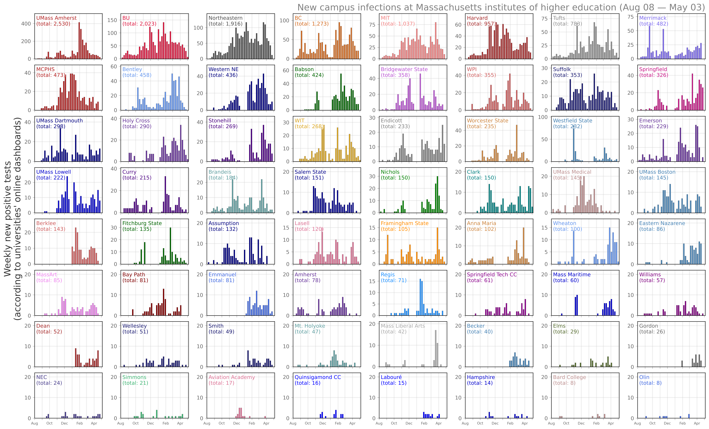
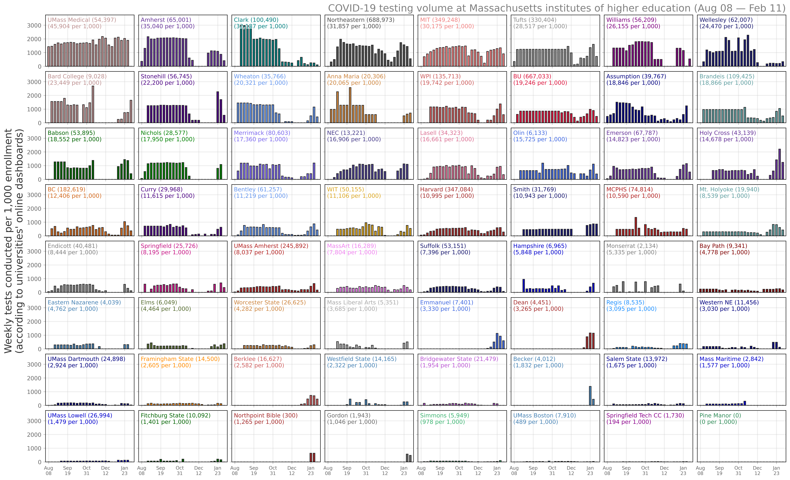

# Massachusetts Institutions of Higher Education COVID
Institutes of higher education (IHE) can play a large role in mitigating the spread of COVID-19, and this is especially true as we await large scale vaccination. Here, I have aggregated the testing numbers and case counts for institutes of higher education in Massachusetts.

## Data and findings
This dataset resides at this [url](https://docs.google.com/spreadsheets/d/1YJt62E16PZkIl2ZPTUhm2fFVdRT6BKidswFKT6aIZsk/edit?usp=sharing), which I pull from in the notebook and save in the /data folder.

- - - -

**
Case counts for 56 institutions statewide.**

**
Test counts for 56 institutions statewide.**

## Limitations
The dashboard for Tufts University needs to be updated daily to get at an estimate for the daily case counts and testing, and this certainly has produced errors. Additionally, the Boston University dashboard does not provide historical testing data (past one week), so the number of tests early in the semester is off.
